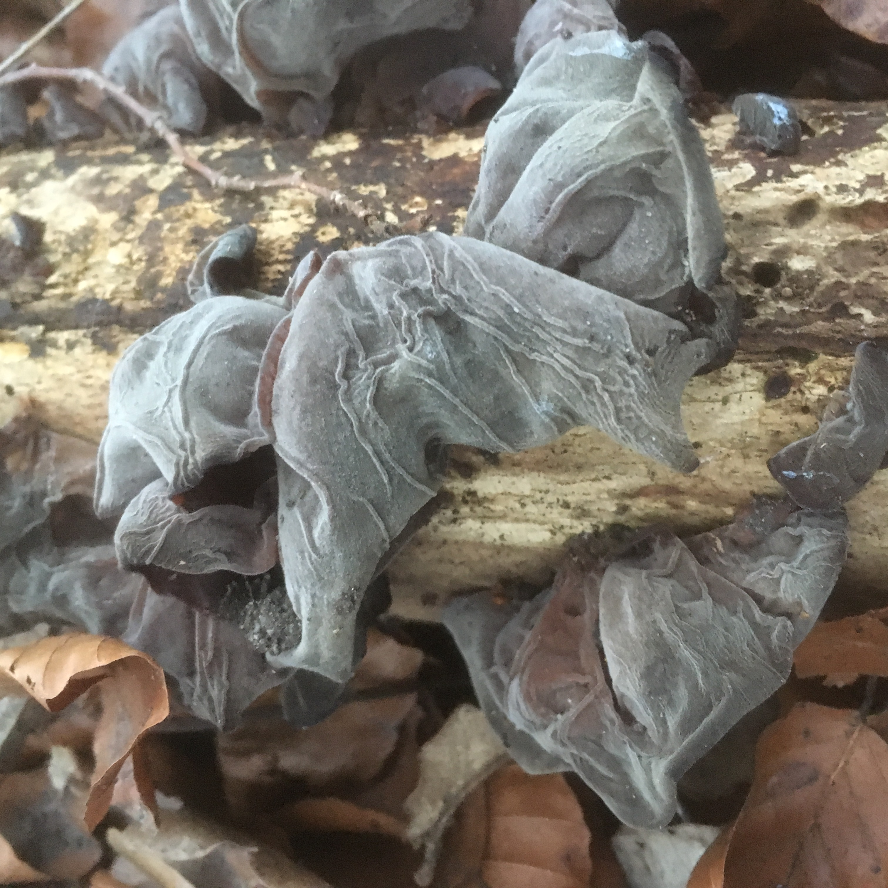

// add cover image to img directory and update filename below
ifdef::backend-html5[]

endif::backend-html5[]

== Colophon

=== Suggested citation

OBIS & GBIF (2024) Joint Strategy for Marine Biodiversity Data. GBIF Secretariat: Copenhagen. 
// Uncomment once a DOI is assigned
//https://doi.org/10.EXAMPLE/EXAMPLE

=== Licence

The document _The special guide to something_ is licensed under https://creativecommons.org/licenses/by-sa/4.0[Creative Commons Attribution-ShareAlike 4.0 Unported License].

=== Persistent URI

#TODO: Assign a DOI before publication#
// Uncomment once a DOI is assigned
//https://doi.org/10.EXAMPLE/EXAMPLE

=== Document control

May 2024
