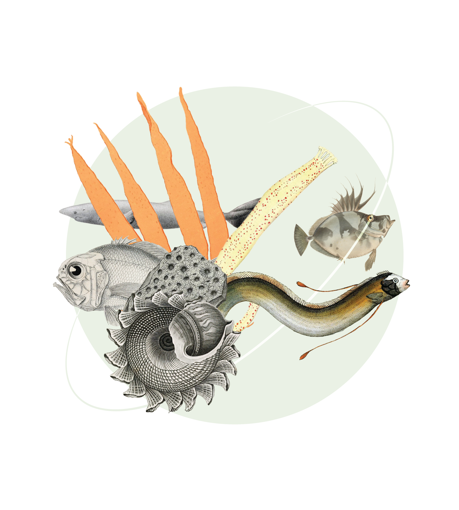

= OBIS-GBIF Joint Strategy for Marine Biodiversity Data
OBIS; GBIF
:toc: left
:toclevels: 2
:numbered:
:revnumber: {git-metadata-sha-short}
:revdate: {git-metadata-date} {git-metadata-time} {git-metadata-timezone}
// Title
:title-page-background-image: 
:title-logo-image: image:img/web/gbif-obis.svg[]
:license: https://creativecommons.org/licenses/by-sa/4.0/

ifdef::backend-html5[]
languageLinks:combined[]
endif::backend-html5[]

:sectnums!:

include::colophon.en.adoc[]

include::100.en.adoc[]
